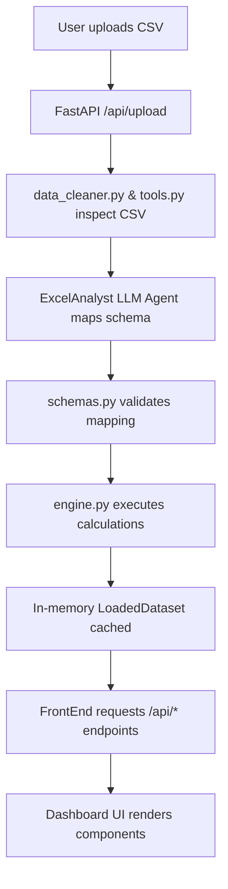

# AI Context & Project Guide: Onboarding SLA Dashboard

This document provides a comprehensive overview of the **Onboarding SLA Dashboard** project for AI coding assistants. It details the system architecture, file structure, domain rules, calculation logic, and interaction boundaries.

---

## 1. Executive Summary & Purpose

The **Onboarding SLA Dashboard** is a local-first application designed to ingest heterogeneous, arbitrary onboarding spreadsheets (CSV format), intelligently map their structure using an LLM-powered agent, and compute deterministic operational SLAs, anomaly alerts, pipeline stages, and team benchmarks.

### Core Architectural Principle: The Strict Separation Triad
1. **Agent (`Agents/ExcelAnalyst/`)**: Uses Gemini via the Google Agent Development Kit (ADK) to *semantically interpret* spreadsheet columns and return a structured Pydantic configuration mapping. The agent **never** performs math, aggregations, or SLA calculations.
2. **Deterministic Engine (`Backend/calculations/`)**: Takes raw data and agent mappings to calculate stage metrics, anomalies, pipeline roll-ups, focus areas, and team comparisons. All math is deterministic, reproducible, and contained in Python.
3. **Frontend (`FrontEnd/`)**: Modern React (Vite) interface that renders visualizations and data tables. The frontend **never** performs calculations or derives metrics; it displays what the backend returns.

---

## 2. Repository File Structure

```
Onboarding_agentic_dashboard/
├── AGENTS.md                         # Core agent instructions and constraints
├── AI_CONTEXT.md                     # [This file] Complete AI architecture and context guide
├── README.md                         # Developer getting-started & run instructions
├── pyproject.toml                    # Python project configuration & dependencies
├── .env                              # Environment variables (GEMINI_API_KEY, GOOGLE_GENAI_USE_VERTEXAI)
│
├── Agents/                           # Agentic column-interpretation module
│   ├── __init__.py
│   └── ExcelAnalyst/
│       ├── __init__.py
│       ├── agent.py                  # ADK agent construction and runner (run_excel_analyst_async)
│       ├── data_cleaner.py           # Deterministic spreadsheet cleaning (headers, whitespace, types)
│       ├── prompts.py                # LLM system instructions, guidelines & task description
│       ├── schemas.py                # Pydantic schemas defining the reviewable mapping contract
│       └── tools.py                  # Spreadsheet inspection & metadata extraction tools
│
├── Backend/                          # FastAPI server & deterministic calculation engine
│   ├── __init__.py
│   ├── main.py                       # FastAPI application, route definitions, in-memory state
│   ├── pipeline_config.py            # Definitions for standard 3-step pipeline rollup
│   └── calculations/
│       ├── __init__.py               # Exports calculation functions
│       ├── configuration.py          # Adapter converting agent JSON into calculation dataclasses
│       ├── engine.py                 # Core calculations: dataset metrics, anomalies, pipeline, team, focus area, partners
│       └── normalization.py          # Dataframe normalization, type coercion, date parsing, rounding
│
├── FrontEnd/                         # React SPA (Vite, Vanilla CSS with Geist font)
│   ├── index.html                    # Root HTML template
│   ├── package.json                  # NPM dependencies & scripts
│   ├── vite.config.js                # Vite build config & proxy to backend (/api -> localhost:8000)
│   └── src/
│       ├── main.jsx                  # React application entrypoint and router configuration
│       ├── index.css                 # Global font imports and root variables
│       ├── components/
│       │   └── home/                 # Dashboard visual components
│       │       ├── DashboardHero.jsx         # Header title and dataset status pill
│       │       ├── DashboardToast.jsx        # Notification toast with auto-dismiss
│       │       ├── EmptyDatasetBanner.jsx    # Empty state prompt to upload CSV
│       │       ├── ErrorBanner.jsx           # Error alert box with retry button
│       │       ├── ExpandingSearch.jsx       # Animated global search input
│       │       ├── FocusAreaSection.jsx      # Standalone section for partners needing attention
│       │       ├── HomeNavBar.jsx            # Top navigation bar (branding, export, upload)
│       │       ├── PartnersListSection.jsx   # Collapsible full table of all dataset partners
│       │       ├── PipelineSection.jsx       # 3-step pipeline rollout cards with substages
│       │       ├── SearchFeedback.jsx        # Search match count and feedback indicator
│       │       ├── SummaryCard.jsx           # Individual KPI card
│       │       ├── SummaryCards.jsx          # KPI grid (Total Partners, Avg Days, Anomalies, etc.)
│       │       ├── TeamComparisonSection.jsx # Average days bar chart grouped by delivery team
│       │       └── index.js                  # Barrel exports for home components
│       ├── hooks/
│       │   ├── useAutoDismiss.js     # Hook to auto-clear notifications after a timeout
│       │   └── useDashboardData.js   # Master state hook fetching summary, pipeline, teams, partners
│       ├── pages/
│       │   ├── HomePage.jsx          # Main dashboard view assembling all section components
│       │   ├── HomePage.css          # Glassmorphism styling and responsive design tokens
│       │   ├── UploadPage.jsx        # Drag-and-drop CSV upload and review flow
│       │   └── UploadPage.css        # Upload page specific styles
│       ├── services/
│       │   └── dashboardApi.js       # Fetch client for all backend REST endpoints
│       └── utils/
│           ├── csvExport.js          # Client-side export of current records to CSV
│           ├── filterOnboardingRecords.js # Search filtering utility
│           ├── formatDuration.js     # Duration string formatters (e.g., "12.5 days")
│           └── mapSummaryFromKpis.js # Adapter mapping API responses to UI metrics
│
├── Data/                             # Sample datasets and validation CSVs
│   ├── onboarding.csv                # Primary sample onboarding dataset
│   └── test_samples/                 # Edge-case CSVs (ambiguous dates, incomplete mappings, etc.)
│
└── tests/                            # Test suite
    ├── test_calculation_engine.py    # Unit tests for engine.py calculations & edge cases
    ├── test_csv_date_validation.py   # Unit tests for strict ISO date validation
    ├── test_upload_api.py            # Unit & async integration tests for FastAPI upload flow
    ├── eval/                         # Agent evaluation datasets
    ├── integration/                  # End-to-end integration tests
    └── unit/                         # Unit tests
```

---

## 3. Data Flow & Lifecycle



1. **Upload**: User uploads a CSV via the UI (`POST /api/upload`).
2. **Inspection & Validation**: CSV is checked for max file size (10 MB), encoding (`utf-8-sig`), and valid date formatting (`YYYY-MM-DD` or `YYYY/MM/DD`). Ambiguous date representations like `MM/DD/YYYY` or `DD/MM/YYYY` are rejected before LLM execution.
3. **Agent Mapping**: `ExcelAnalyst` inspects sample rows, column headers, and data distributions to identify:
   - Identifier column (e.g., `PSA ID`, `Worker ID`)
   - Partner Name column (e.g., `Name`, `Partner Name`)
   - Project/Team column (e.g., `Project Details`, `Delivery Team`)
   - Onboarding Start & Completion columns
   - Ordered stages with duration columns or start/end date column pairs.
4. **Deterministic Calculation**: `engine.py` receives the raw dataframe and mapping configuration to generate:
   - Global KPIs (Total records, avg/min/max total duration, anomaly counts).
   - Per-stage averages, standard deviations, and anomaly cutoffs ($Cutoff = Average + 1 \times Standard Deviation$).
   - 3-Phase standard pipeline mapping (`resource_fulfilment_to_identification`, `identification_to_onboarding`, `onboarding_to_billing`).
   - Team comparisons grouped by delivery team.
   - Focus areas: in-progress partners whose current stage duration is $\ge 75\%$ of stage average or flagged as anomalies.
   - Partners list: complete standardized list of all partners across all stages.
5. **Caching**: Dataset and calculations are held in-memory in `CURRENT_DATASET` for fast querying across dashboard endpoints.
6. **Frontend Display**: React dashboard fetches modular sections independently via REST endpoints and renders them with loading skeletons and error retries.

---

## 4. API Endpoints Reference

All endpoints are hosted under `http://localhost:8000/api`:

| Method | Endpoint | Description |
| :--- | :--- | :--- |
| `POST` | `/api/upload` | Upload CSV, run agent mapping, calculate dataset, cache in memory, return results. |
| `GET` | `/api/summary` | Returns high-level dashboard KPIs, configuration, and records list. |
| `GET` | `/api/pipeline` | Returns the 3-phase roll-up pipeline with substage metrics and averages. |
| `GET` | `/api/team-comparison` | Returns team-by-team averages and partner counts for a given stage (query param: `?stage=...`). |
| `GET` | `/api/focus-area` | Returns partners needing attention (approaching stage average or potential anomalies). |
| `GET` | `/api/partners` | Returns the complete standardized list of all partners (name, team, current stage, days, status). |
| `GET` | `/api/candidates` | Returns raw column headers and full record-level rows. |
| `GET` | `/api/dataset-info` | Returns active dataset metadata (filename, rowCount). |
| `GET` | `/api/health` | Readiness probe returning `{"status": "ok"}`. |

---

## 5. Calculation Engine Rules (`Backend/calculations/engine.py`)

- **Duration Prioritization**:
  - If a stage has a `duration_column` with numeric values, that value is used directly (`source: "provided_duration"`).
  - If no numeric duration is mapped or present, duration is derived from `(end_date - start_date).days` (`source: "derived_from_dates"`).
  - Values $> 365$ days or negative values are flagged as data quality issues and excluded from calculation.
- **Anomaly Detection**:
  - Sample standard deviation ($s$) is calculated for each stage.
  - $AnomalyCutoff = \mu + 1 \times s$ (where $\mu$ is the stage average).
  - Any partner whose stage duration $> AnomalyCutoff$ is marked `isAnomaly: true`.
- **Focus Area Threshold**:
  - Defined as $Threshold = 0.75 \times \mu$.
  - Incomplete partners who are active in a stage with duration $\ge Threshold$ (or exceeding cutoff) are included in the focus area.
- **Total Onboarding Duration**:
  - Calculated for **completed** partners only.
  - Primary method: `completion_date - start_date`.
  - Fallback method: sum of all stage durations when all stages have non-null values.

---

## 6. Frontend Design System & Architecture

- **Styling**: Vanilla CSS with Geist font (`@fontsource-variable/geist`). Glassmorphism aesthetic with soft shadows, subtle borders, frosted glass backdrops (`backdrop-filter: blur(...)`), and responsive flex/grid layouts.
- **Prefix Conventions**:
  - Dashboard classes use `hn-*` prefix (e.g., `hn-focus-area`, `hn-team-comparison`, `hn-partners-list`).
  - Upload page classes use `up-*` prefix.
- **Section Component Standard**:
  - Standalone component file in `FrontEnd/src/components/home/`.
  - Section wrapper with eyebrow header (`<p className="hn-eyebrow">...</p>`) and title (`<h2>` or `<h3>`).
  - Standardized props: `{ data, loading, error, onRetry, datasetLoaded }`.
  - Self-contained empty, loading (skeleton), and error (`<ErrorBanner onRetry={...} />`) states.

---

## 7. Rules & Invariants for AI Coding Assistants

1. **Preserve Determinism**: Never move business logic, SLA math, anomaly detection, or statistical calculations into the frontend.
2. **Preserve Source Column Headers**: Never mutate or normalize the original column header names in agent mapping; exact source headers must be preserved to reference raw rows.
3. **No Dates from Durations**: Never interpret a numeric column (such as SLA duration days) as a date simply because the column header contains the word "Date" or "SLA".
4. **Scope Control**: This is a local-first learning project. Do not introduce cloud deployment tools, Docker/Kubernetes, CI/CD pipelines, or switch the Gemini model unless explicitly requested by the user.
5. **No Ad-Hoc CSS Frameworks**: Do not install or introduce TailwindCSS or component libraries unless explicitly requested. Use existing Vanilla CSS patterns in `HomePage.css`.
6. **Backward Compatibility**: When adding or updating sections, ensure existing sections (`PipelineSection`, `TeamComparisonSection`, `FocusAreaSection`) continue to function without unintended side effects.

---

## 8. Development & Verification Commands

### Backend Verification
```bash
# Verify Python syntax across agent and backend files
.venv/bin/python -m py_compile Backend/**/*.py Agents/ExcelAnalyst/*.py

# Run all test suites
.venv/bin/python -m unittest discover tests

# Run specific engine unit tests
.venv/bin/python -m unittest tests/test_calculation_engine.py

# Start backend server
.venv/bin/python -m uvicorn Backend.main:app --reload
```

### Frontend Verification
```bash
# Verify production build and asset bundling
cd FrontEnd
npm run build

# Start local Vite dev server
npm run dev
```
